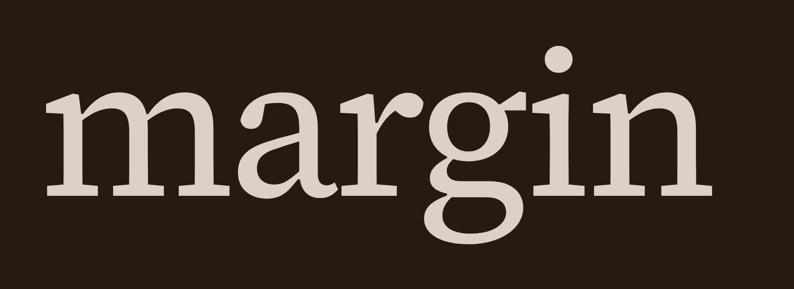
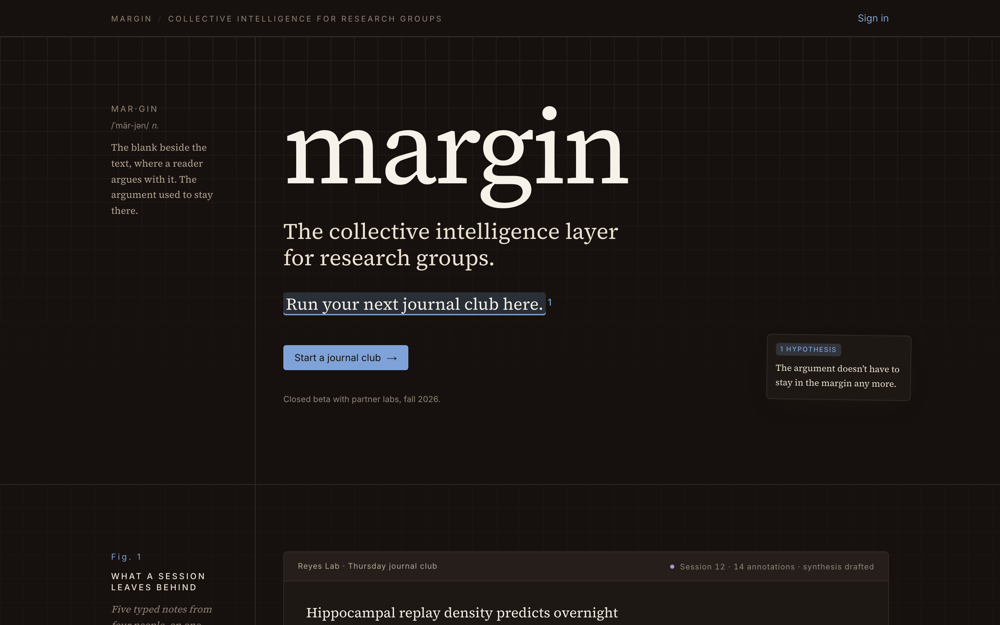
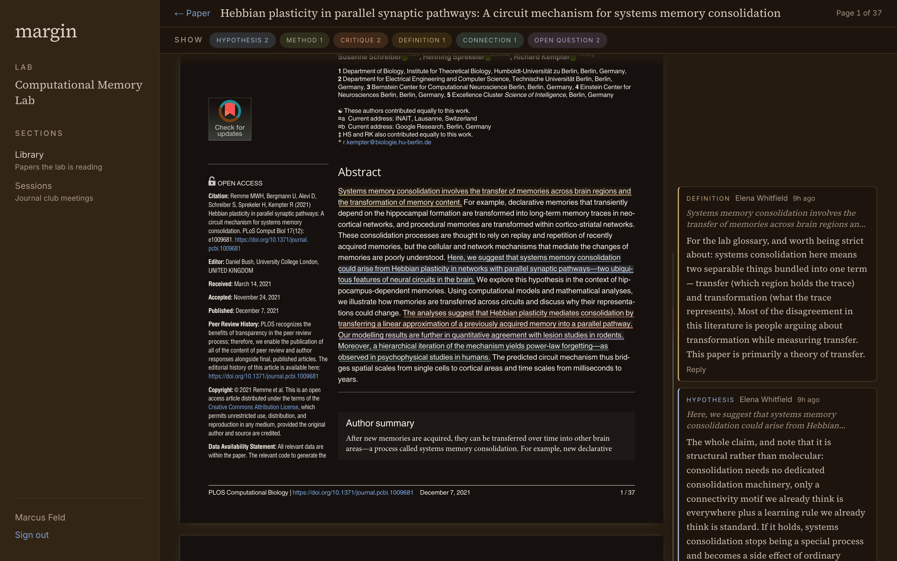
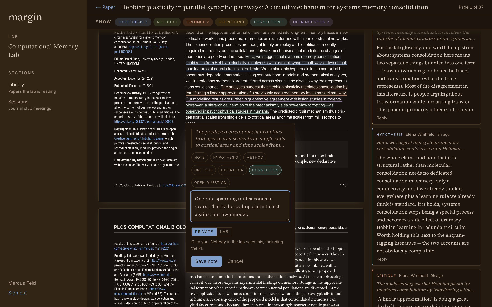
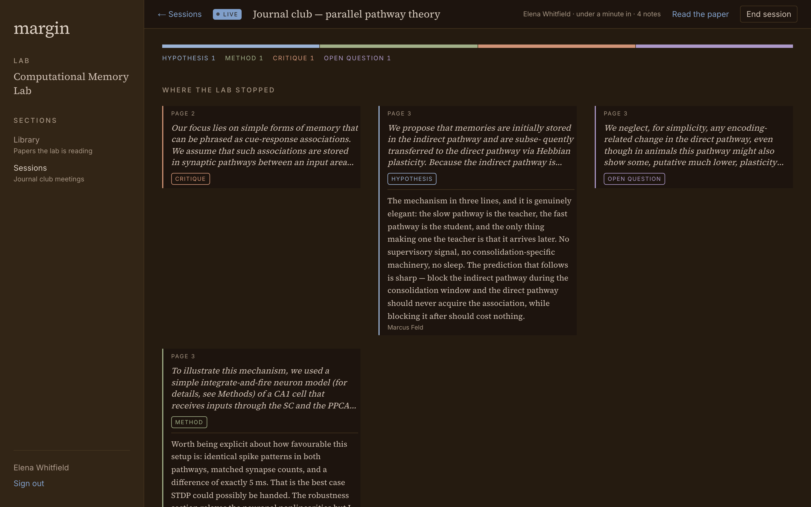
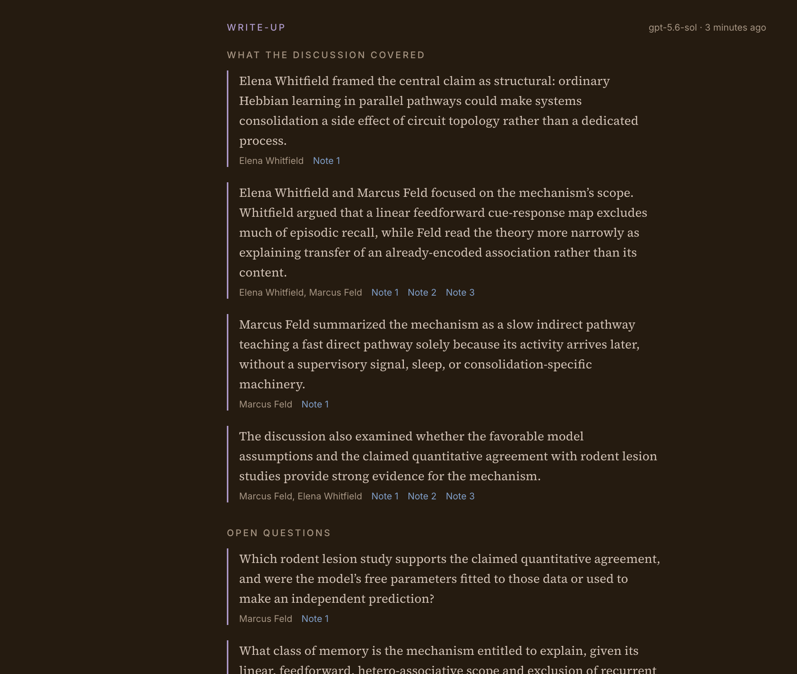
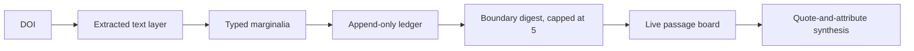
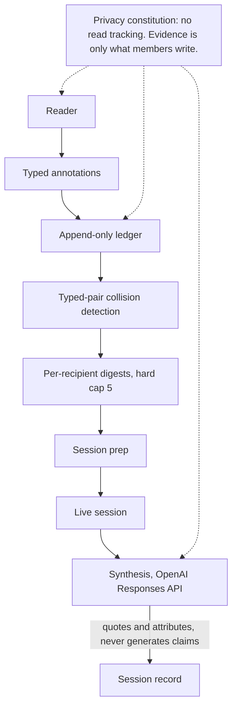

<h1 align="center">Margin</h1>

  

  <strong>The collective intelligence layer for research groups.</strong>

  Margin is a journal club platform where a lab annotates papers together in a shared margin, and the typed notes it leaves become a durable, queryable record of what the group actually argued about.

  <a href="https://margin-ochre-three.vercel.app/"><strong>Live website</strong></a>

  
  
  
  
  
  
  
  
  

## Product

Margin is where a research group runs its journal club. A lab brings in a paper by DOI, annotates it together in a shared margin before the meeting, and runs the discussion off the passages it flagged. Every note carries a type — hypothesis, method note, critique, definition, connection, open question — so the reading leaves a structured record instead of a drawer of highlights, and that record is what the next session, the next member, and the write-up are built from. The model layer only ever quotes and attributes what the lab already said.

The product stays in its warm brown dark mode throughout:

  

<em>Fig. 1 — The landing page, where the page itself demonstrates a shared margin.</em>

  

<em>Fig. 2 — The reader: typed notes anchored to passages in one paper.</em>

  

<em>Fig. 3 — The composer: choose a note type and visibility before saving the thought.</em>

  

<em>Fig. 4 — The live session: the room runs from the passages the lab flagged.</em>

  

<em>Fig. 5 — The write-up: every claim is quoted from an annotation and attributed to its author.</em>

## First Session

| Step | A lab's first journal club | Margin output |
| --- | --- | --- |
| Ingest | Someone pastes a DOI | Crossref record, open-access PDF, per-page extracted text layer |
| Annotate | Members read into the margin beforehand | Typed marginalia anchored to passages, visibility-controlled |
| Prep | Two hours before the meeting | Digest of gold collisions, passage-addressed, capped at 5 |
| Discuss | The meeting runs off what the lab flagged | Live typed passage board; private notes never shown |
| Record | The session ends | Quote-and-attribute synthesis, sectioned by annotation type |

## Architecture

| Layer | Stack | Role |
| --- | --- | --- |
| Frontend | Next.js 15 App Router, React 19, Tailwind v4 | Landing, reader, margin rail, session projector, session record |
| Backend | Convex — database, actions, scheduler, file storage | Papers, annotations, sessions, digests, stored PDFs |
| Auth | Convex Auth, password provider | Email and password hashed on the deployment; every lab-scoped read authorized against `memberships` |
| Ledger | Append-only `events` table | The provenance record: every meaningful act in a lab, never updated, never deleted |
| Anchoring | W3C-style redundant selectors, fuzzy re-anchoring | Annotations survive PDF variants; drift is surfaced rather than silently moved; 78 unit tests |
| Digests | Deterministic typed-pair collision detection | Simulation-validated cap-5 policy, per-recipient staleness cursors, no model in the loop |
| Synthesis | OpenAI Responses API, structured outputs | Sectioned write-up; attribution derived from the citations, never taken from the model |
| CI | GitHub Actions, Vitest, Playwright, Greptile | Lint, types, 149 unit tests, backend-free browser smoke, privacy-constitution guard, review |

## What It Proves

| Product question | Margin answer |
| --- | --- |
| Can an annotation survive a different copy of the same PDF? | Yes. Every anchor carries a text-quote selector with prefix and suffix context alongside position offsets, and re-anchors fuzzily; when a passage moves, the note says so with a drift badge instead of pointing at the wrong sentence. |
| Can a lab see where it is converging without surveillance? | Yes. Convergence is computed from typed-pair collisions between notes members chose to write. There is no read tracking anywhere in the system, and a CI schema guard fails the build if any is added. |
| Can AI be trusted inside scholarship? | Yes. The synthesis is constrained to quote and attribute existing annotations rather than generate claims, and attribution is derived from the citations it emits, so a stored name cannot be one the model chose. |
| Can delivery avoid notification fatigue? | Yes. Digests are computed at boundaries rather than on write, addressed per recipient from a staleness cursor, and hard-capped at five items — a shape validated by simulation across lab sizes 5 to 25. |
| Is the privacy stance mechanical rather than editorial? | Yes. The guard reads `convex/schema.ts` back through Convex's own validator introspection, so a `reads` table, a `viewedAt` field, or a read event type is a failing build rather than a broken promise. |

## View

| Link | URL |
| --- | --- |
| Live website | https://margin-ochre-three.vercel.app/ |
| YouTube walkthrough | Coming soon |
